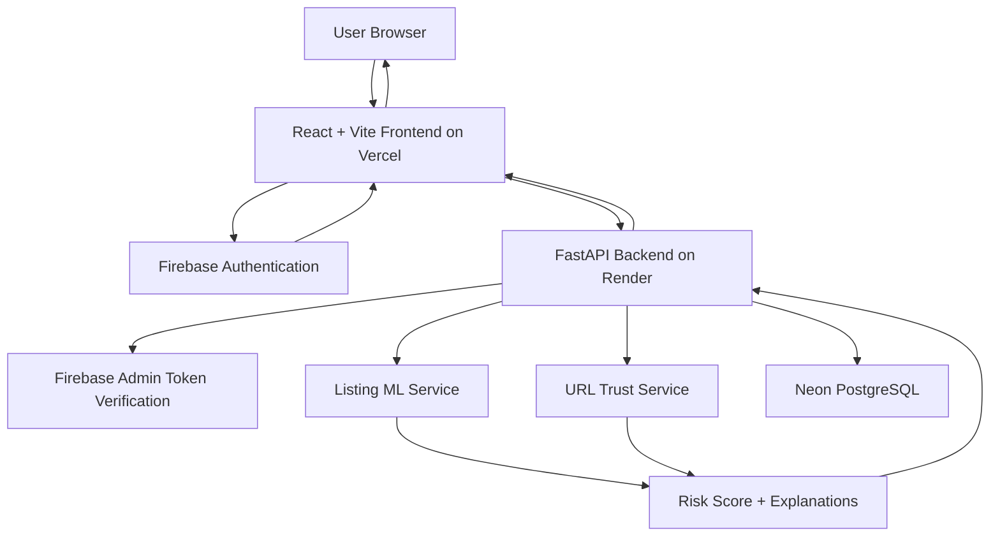

# #hackthekitty 2026 Project Report

**Project Name:** ScamPurr AI  
**Reference ID:** 

## 1. Executive Summary

ScamPurr AI helps people detect suspicious cat adoption listings and shelter URLs before they send money, share personal information, or trust a fake listing. The app combines listing-text analysis, URL trust checks, Firebase authentication, guest access, and explainable risk scoring so users can understand why something looks safe or suspicious.

## 2. Project Overview

### 2a. Why We're Building What We're Building

Pet adoption scams often exploit urgency, emotional stories, fake shipping fees, and unverifiable shelter pages. People searching for cats may not know which warning signs to look for, especially when scammers copy legitimate adoption language.

ScamPurr AI addresses this gap by giving users a fast, explainable way to check adoption text and URLs. Instead of only returning a label, it shows specific trust signals and red flags such as suspicious payment methods, refusal to meet in person, missing adoption relevance, risky domains, HTTPS status, and domain patterns.

### 2b. How It Relates To The Theme

The project directly connects to the cat-focused hackathon theme by protecting future cat adopters from scams. It treats the internet as a place where cats should safely "dominate" by helping real shelters, real cats, and real adopters avoid fraudulent listings.

### 2c. Target Audience

ScamPurr AI is designed for:

- People looking to adopt cats online
- First-time adopters who may not know scam warning signs
- Animal rescue volunteers reviewing suspicious listings
- Shelters that want to educate adopters about safe adoption practices

## 3. Key Features

- Guest listing and URL checks without saving user history
- Firebase Google sign-in and email/password account creation
- Email verification and password reset for email accounts
- Saved analysis history for signed-in users
- Listing text scam analysis with explainable red flags and trust signals
- Shelter/listing URL trust scoring with HTTPS, domain, reputation, and relevance checks
- Combined listing plus URL risk scoring
- Cat adoption relevance warnings for unrelated text or URLs
- Public aggregate URL check counter
- Backend rate limiting and request validation

## 4. Technology Stack

| Layer | Technology |
| --- | --- |
| Frontend | React, TypeScript, Vite |
| Styling/UI | Tailwind CSS, Framer Motion, Lucide React |
| Routing/Data | React Router, TanStack Query, Axios |
| Forms/Validation | React Hook Form, Zod |
| Authentication | Firebase Authentication, Firebase Web SDK |
| Backend | FastAPI, Python, Uvicorn |
| Backend Validation/Config | Pydantic, Pydantic Settings |
| Database | Neon PostgreSQL in production, SQLite locally |
| ORM | SQLAlchemy |
| Backend Auth Verification | Firebase Admin SDK |
| Machine Learning | scikit-learn, TF-IDF, Random Forest, pandas, NumPy, NLTK, joblib |
| URL Analysis | WHOIS, SSL certificate checks, optional Google Safe Browsing and VirusTotal |
| Deployment | Vercel frontend, Render backend |
| Monitoring | UptimeRobot health checks |

## 5. Technical Architecture

ScamPurr AI uses a React frontend deployed on Vercel and a FastAPI backend deployed on Render. Firebase handles authentication, while the backend verifies Firebase ID tokens with the Firebase Admin SDK before saving user-specific history in Neon PostgreSQL.

Guest users can run listing and URL checks without creating an account. Guest results are returned to the browser and are not saved to user history, but URL checks still contribute to the aggregate URL check counter. Signed-in users receive the same analysis flow, plus saved history.

**Request flow:**

1. A user opens the Vercel frontend.
2. The user either continues as guest or signs in with Firebase.
3. The frontend sends listing text, URL, or both to the FastAPI backend.
4. For signed-in users, the backend verifies the Firebase ID token.
5. The backend runs listing analysis, URL analysis, or combined scoring.
6. The backend returns a risk score, label, explanations, and detected signals.
7. Signed-in results are saved to PostgreSQL history. Guest results are not saved to user history.

## 6. Testing Matrix

| Feature / Flow | Steps | Expected Result | Actual Result | Pass / Fail |
| --- | --- | --- | --- | --- |
| Frontend production build | Run `npm run build` in `frontend` | Build completes successfully | Build completed successfully with existing chunk-size warning | Pass |
| Frontend lint | Run `npm run lint` in `frontend` | No lint errors | No lint errors | Pass |
| Backend tests | Run `python -m unittest discover -s tests` in `backend` | All backend tests pass | 5 tests passed | Pass |
| Backend health endpoint | Open `/health` on Render backend | Returns status `ok` | Health endpoint returned `ok` | Pass |
| Guest listing analysis | Continue as guest and submit adoption listing text | Result page shows risk score and explanations | Guest listing analysis worked | Pass |
| Guest URL analysis | Continue as guest and submit a URL | Result page shows URL trust score and explanations | Guest URL analysis worked | Pass |
| Signed-in Google auth | Sign in with Google | User reaches dashboard | Firebase Google login worked | Pass |
| Email account creation | Create account with email/password | Verification email is sent before sign-in | Verification email flow worked | Pass |
| Unverified email sign-in | Try signing in before email verification | User is blocked and asked to verify email | Unverified password users are blocked | Pass |
| Password reset | Use Forgot password | Reset email is sent | Password reset flow added and available | Pass |
| Saved history | Run analysis while signed in | Analysis appears in history | Signed-in history flow available | Pass |
| Guest history behavior | Run analysis while logged out | Result works but does not save to user history | Guest mode does not save user history | Pass |
| Non-cat relevance warning | Submit unrelated text or non-pet URL | App warns that content may not be cat-adoption related | Relevance warnings added | Pass |
| Legitimate shelter-style listing | Submit proper adoption process text | App shows trust signals and lower risk | Legitimate listing flow worked | Pass |

## 7. Security Review

Aikido Security was used to scan the project for dependency, application, and source-control security issues. Earlier dependency and frontend header findings were addressed by updating vulnerable packages and adding production security headers.

The remaining Aikido finding is:

| Finding | Severity | Category | Status |
| --- | --- | --- | --- |
| GitHub organization should enforce an IP allow list | Medium | SCM Security | Reviewed |

This finding does not directly affect the security of the running ScamPurr AI application because the project is hosted in a personal GitHub account, not a GitHub Enterprise organization. GitHub IP allow lists are an organization/enterprise access-control feature used to restrict which networks can access source code. ScamPurr's runtime security does not depend on a GitHub organization IP allow list.

The deployed application is still protected through the controls that matter for the live system:

- Firebase authentication is used for user sign-in.
- Backend APIs verify Firebase ID tokens with Firebase Admin SDK.
- Guest mode does not save user history.
- Production CORS is limited to the frontend origin.
- Secrets are loaded from Render, Vercel, Firebase, and Neon environment settings instead of being committed to the repository.
- Vercel security headers are configured for the frontend.
- Backend request validation and rate limiting are enabled.

The remaining Aikido item is therefore treated as a repository hardening recommendation, not a blocker for application security. If the project later moves into a GitHub Enterprise organization, enabling an IP allow list can be reconsidered.

## 8. Future Improvements

- Improve the dataset with more real cat adoption scam and legitimate shelter examples.
- Train and evaluate a stronger production model with better calibration and validation metrics.
- Add more automated tests for authentication, guest flows, API errors, and frontend result rendering.
- Add production monitoring dashboards for latency, API errors, and model output quality.
- Add a clearer public privacy/data-use notice for submitted listings and URLs.

## 9. Tools You Used
- Antigravity IDE
- Codex coding assistant
- Firebase Console
- Vercel
- Render
- Neon PostgreSQL
- UptimeRobot
- Aikido Security
- Git and GitHub
- npm
- Python virtual environment and pip

## 11. Learnings & Takeaways

Building ScamPurr AI showed how important it is to make AI/security tools explainable, not just predictive. A simple "safe" or "risky" label is not enough for adoption scams because users need to understand specific warning signs before making a decision.

The project also reinforced the difference between guest and authenticated product flows. Guest access makes the tool useful immediately, while Firebase authentication and saved history make it more valuable for repeat users.

Technically, the biggest takeaways were around production readiness: validating tokens on the backend, handling unverified email accounts, keeping guest data separate from user history, adding security headers, checking dependencies, and making sure deployed behavior matches local behavior.

## 12. Acknowledgments

- Firebase for authentication
- FastAPI, React, Vite, and SQLAlchemy open-source projects
- scikit-learn and NLTK for model training support
- Google Safe Browsing and VirusTotal API support for optional URL reputation checks
- Render, Vercel, and Neon for deployment infrastructure

## Submission Checklist

- Video demo: Pending
- README.md with prerequisites, run instructions, and configuration: Complete
- Project report in `documentation/`: Complete
- Source code: Present in `frontend/src` and `backend/app`
- No unrelated package folders such as `node_modules`, `dist`, or virtual environments committed: Verify before final submission
